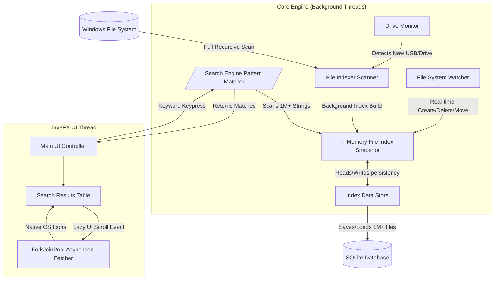

# FindIT 🔍

FindIT is a high-performance, pure Java desktop file search engine. Inspired by tools like *Everything*, it indexes your computer's hard drives to provide instant, millisecond-level exact-match and regex search capabilities across millions of files.

Built using Java 17 and JavaFX 21, FindIT requires no JNI (Java Native Interface) or native Windows dependencies, utilizing advanced concurrent algorithms to achieve bare-metal file parsing speeds.

---

## 🚀 Architecture Workflow

The system is built on a concurrent, multi-threaded MVC architecture with a pure backend engine that operates independently of the JavaFX User Interface.



---

## ⚡ Technical Highlights

Scanning millions of files in milliseconds requires highly optimized architecture. FindIT achieves extreme efficiency through the following core design pillars:

### 1. Zero-Allocation String Matching
To process queries against an index of millions of files without triggering Garbage Collection (GC) pauses, FindIT utilizes zero-allocation `String.regionMatches()`. Instead of creating lowercased duplicate objects dynamically, the engine scans the raw characters in the original file names directly in memory. This eliminates millions of heap allocations, reducing search time down to single-digit milliseconds (O(1) memory overhead).

### 2. Upfront Regex Compilation
When utilizing complex patterns or wildcards (`*.exe`), the engine translates the query into a Java Regular Expression. Rather than repetitively recompiling the regex string grammar during the inner file iteration loop, FindIT compiles the state machine into an immutable, highly optimized Pattern object exactly once before execution. 

### 3. Virtual TableView Capping
Pushing unchecked datasets onto a virtualized JavaFX `TableView` forces the main UI thread to compute extensive layout mathematics, potentially blocking the render pipeline. FindIT implements an algorithmic flow limit on UI pushes without restricting the actual background search size. The user receives thousands of instantaneous results populated smoothly through virtualized lazy-loading.

### 4. Non-Blocking Native Icon Fetching
Retrieving native OS icons (e.g., embedded Windows executable icons) is notoriously thread-blocking. FindIT delegates these API queries to a robust `CompletableFuture` ForkJoinPool. To safeguard the JavaFX Application Thread from `runLater` cascades, strictly validated cell-lifecycle checks are executed before graphics assignment, supplemented by an optional "Raw Mode" (Settings > Appearance) to disable icons entirely for maximum throughput.

### 5. Atomic Background Re-Indexing
FindIT maintains a continuous, uninterrupted user experience even during a full re-scan. When a new drive is detected or a full systemic scan is requested, an isolated background thread builds a complete shadow index. Your current data loaded from the local `SQLite` database remains entirely searchable. The active index is only atomically swapped via `CopyOnWriteArrayList` mechanisms upon total successful completion of the background scan.

---

## 🛠 Features & Search Syntax

**Basic Search:**
*   Type `java` to match files or folders containing the string *java*.
*   Matches are case-insensitive by default.

**Toggle Buttons (Right side of search bar):**
*   **Aa**: Match Case exactly.
*   **" "**: Whole Word exact bounds.
*   **\\**: Match against the absolute File Path, not just the file name.
*   **.***: Enable raw Java Regular Expressions.

**Prefix Commands:**
*   `ext:png` or `ext:docx,pdf` to filter explicitly by file extensions.
*   `path:C:\Users` to limit the search scope to a specific path.
*   `re:^test[0-9]+\.txt$` to execute an overriding Regex query anywhere in the pipeline.
*   `-` (Exclude): type `-temp` or `-AppData` to strictly eliminate matches.

---

## 👨‍💻 Compilation & Execution

FindIT utilizes Java 17 and Apache Maven.

1.  **Clone the Repository**
2.  **Build the Fat JAR**
    ```bash
    mvn clean package -P fatjar -DskipTests
    ```
3.  **Run the Application locally**
    ```bash
    java -jar target/FindIT-1.0-fat.jar
    ```
